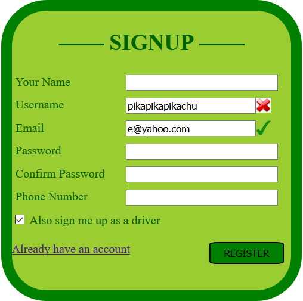
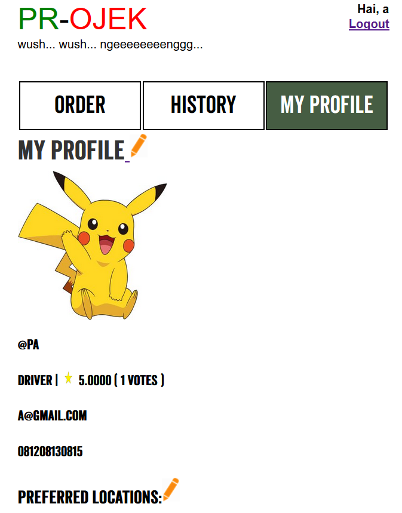
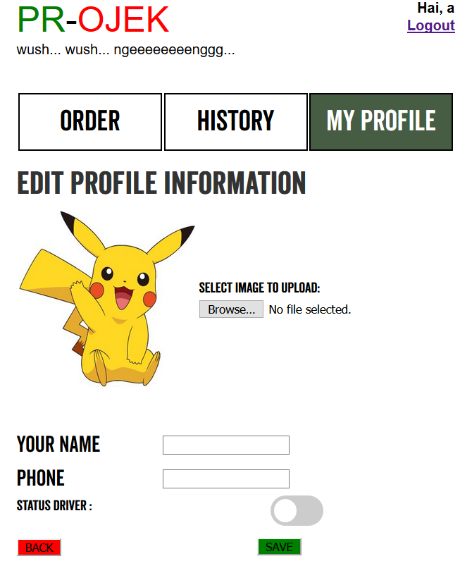
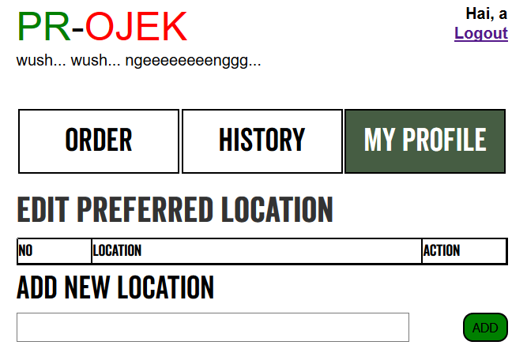
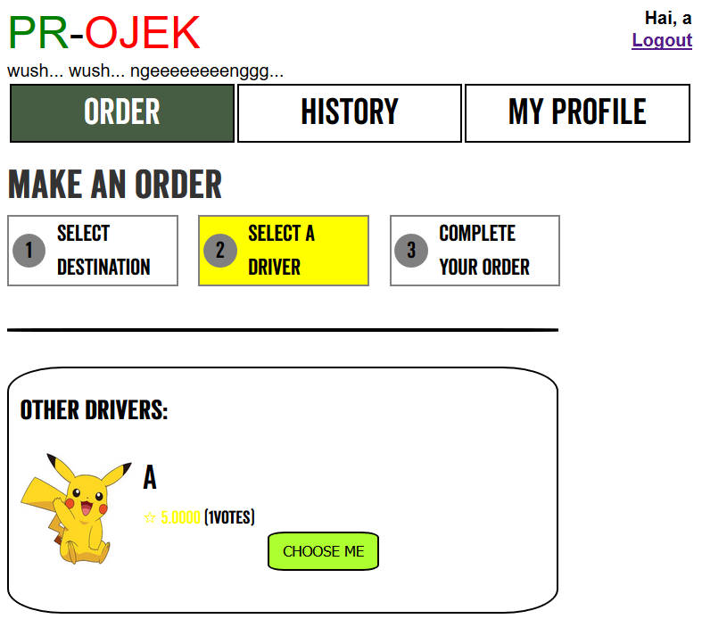
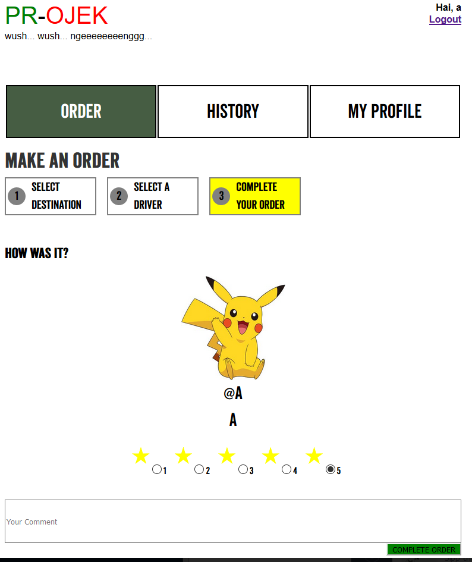
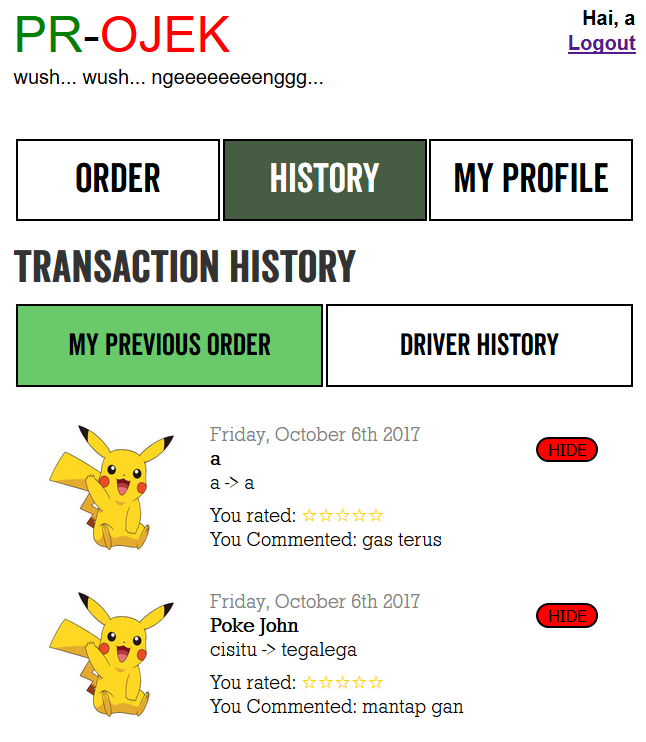
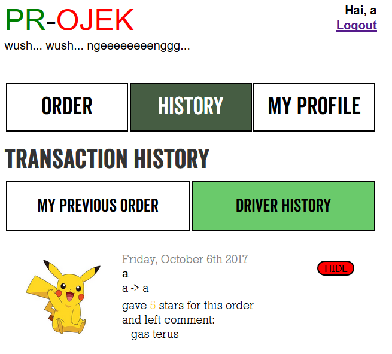

# Tugas 1 IF3110 Pengembangan Aplikasi Berbasis Web

Membuat sebuah Website Ojek Online

## Tampilan
Tampilan dari web kami adalah sebagai berikut :
### Login

### Register

### Profile

### Edit-Profile

### Edit-Preferred-Location

### Order-Ojek

### Select-Driver

### Complete-Order

### History

### Pembagian Tugas
**Tampilan**
1. Login : 13515095
2. Daftar : 13515095
3. Gagal : 13515095
4. Pesan : 13515095
5. Pesan supir : 13515095, 13515104
6. Pesan selesai : 13515095
7. Profil : 13515104
8. Edit Profil : 13515104
9. Riwayat : 13515017
10. Riwayat Supir : 13515017
11. Edit Preference Location : 13515017

**Fungsionalitas**
1. Login : 13515095
2. Daftar : 13515104
3. Gagal : 13515095
4. Pesan : 13515104
5. Pesan supir : 13515104
6. Pesan selesai : 13515095, 13515017
7. Profil : 13515104
8. Edit Profil : 13515104, 13515107
9. Riwayat : 13515017
10. Riwayat Supir : 13515017
11. Edit Preference Location : 13515017

